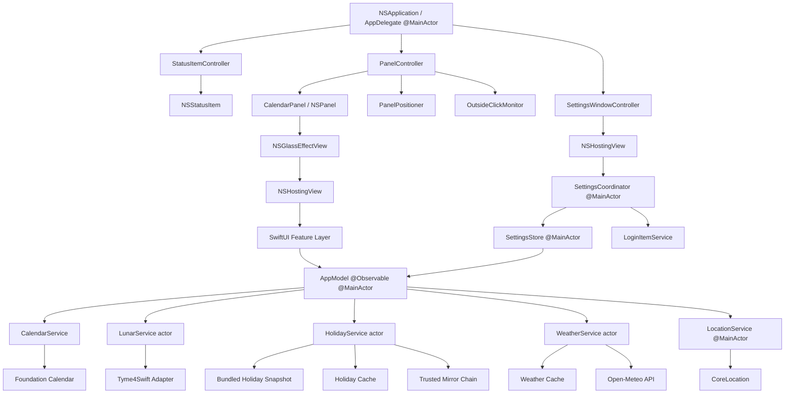

# Calenda 原生 macOS 菜单栏日历设计方案
文档状态：Final 2.1
编写日期：2026-08-18
修订日期：2026-08-20
目标版本：MVP 1.0
## 1. 结论摘要
Calenda 是一个仅驻留在 macOS 菜单栏的原生日历工具。应用采用 SwiftUI + AppKit Hybrid：AppKit 负责 NSStatusItem、NSPanel、窗口定位、焦点、多屏、Spaces 和点击外部关闭，SwiftUI 通过 NSHostingView 负责月历、详情、设置和动画内容。核心数据由本地公历计算和 Tyme4Swift 农历计算提供，并辅以中国法定节假日、调休、节气、天气和位置能力。
MVP 不建设服务端，不接入收费 API，不采集账号信息，不做日程管理。公历、农历和节气在离线状态下完整可用；节假日和天气采用本地缓存、最后一次有效数据及明确的降级状态，任何远程故障都不能阻断月历显示。
项目以 MIT 许可证在 GitHub 开源，官方版本采用非商业方式发布。天气使用 Open-Meteo 免费公共接口，并在天气信息附近展示数据来源链接。任何商业化下游版本必须替换为允许商业使用的数据源、购买对应方案，或移除天气能力。
### 1.1 已确认约束
- 发布方式：GitHub 开源、非商业发布、无服务端、无收费 API。
- 开源许可：MIT；第三方代码、数据和服务条款在 THIRD_PARTY_NOTICES.md 中单独列明。
- 二进制分发：GitHub Release 提供 Developer ID 签名、公证并装入 DMG 的正式版本。
- 系统基线：macOS 26 及以上，只面向最新 macOS 体验，不实现旧系统兼容分支。
- 必备入口：菜单栏弹窗底部提供“设置”，Command + , 也可打开同一设置窗口。
- 必备设置：一周起始日、城市/当前位置、天气单位、日历显示项、节假日更新、登录时启动、缓存与隐私数据管理。
- 默认值：一周从周一开始；城市为北京市并明确标记“默认城市”；登录时启动默认关闭。
## 2. 产品目标
- 点击菜单栏图标后，在一个弹窗内快速查看当前月历、选中日期详情、农历、节气、节假日、调休和当前天气。
- 首次打开时无需配置即可使用日历；位置权限和网络能力均为可选增强。
- 对中国大陆用户提供准确、易辨认的农历与法定放假/调休信息。
- 在断网、定位拒绝、远端数据损坏和镜像不可用时保持核心体验可用。
- 采用清晰的模块边界，使天气源、节假日源和农历库可独立替换。
- 提供可发现、可恢复且即时生效的设置管理，不要求用户编辑文件或重启应用。
## 3. 非目标
- 不读取或编辑系统日历、提醒事项和联系人。
- 不提供账号、云同步、跨设备同步或团队功能。
- 不做服务端代理、遥测平台、推送服务或后台常驻轮询。
- 不提供节假日工资计算、请假规划或政府公告的法律解释。
- MVP 不支持 iOS、iPadOS、Windows 或 Web。
- MVP 不做 App Store 内购、订阅或广告。
- MVP 界面语言为简体中文；所有用户可见字符串进入 String Catalog，为后续本地化保留结构，但 1.0 不承诺英文翻译。
## 4. 用户与核心场景
### 4.1 目标用户
- 日常需要快速确认日期、星期、农历、节气和调休安排的 macOS 用户。
- 不希望打开完整日历应用，只需要低打扰查询的人群。
### 4.2 核心场景
1. 用户点击菜单栏日期图标，立即看到当前月和今天的详情。
2. 用户点击某一天，右侧详情同步显示日期、星期、农历、节气、节假日和调休状态。
3. 用户用左右按钮或键盘切换月份，用“返回今天”恢复当前日期。
4. 用户允许定位后查看当前城市天气；拒绝定位时可选择城市或继续使用默认城市。
5. 网络异常时，应用显示缓存天气和节假日数据，并标明更新时间或降级状态。
6. 用户从弹窗底部或 Command + , 打开设置，修改一周起始日后月历立即重排，选中日期保持不变。
7. 用户切换手动城市或当前位置后，旧天气请求被取消，新城市名称与天气原子切换，不出现城市和天气错配。
## 5. 界面设计
### 5.1 总体形态
使用 NSStatusItem 作为菜单栏入口，点击后由 PanelController 显示自定义 NSPanel。面板内容通过 NSHostingView 承载 SwiftUI 根视图。默认内容尺寸为 680 × 460 pt，允许在 620 × 420 至 780 × 560 pt 范围内适应系统大文字；月历格保持稳定，详情区在空间不足时可滚动。应用设置 LSUIElement 为 true，并使用 accessory activation policy，不在 Dock 和应用切换器中出现。
```text
macOS Menu Bar：图标 + 当日数字
        ↓ 点击
┌─────────────────────────────────────────────────────────┐
│ 2026        ‹      08 月      ›              返回今天  │  52
├────────────────────────────────────┬────────────────────┤
│ 周一  周二  周三  周四  周五  周六  周日 │ 10:50              │
│                                    │ 星期二              │
│             月历 6 × 7             │                    │
│                                    │        18          │
│ 公历日 / 农历日 / 节气             │ 七月初六            │
│ 节日 / 休 / 班                     │ 处暑 · 还有 5 天    │
│                                    │ ☀ 29°  北京市      │
├────────────────────────────────────┴────────────────────┤
│ 数据状态 / 设置 / 退出                                 │  34
└─────────────────────────────────────────────────────────┘
```
### 5.2 布局分区

| 区域 | 设计尺寸 | 内容 | 交互 |
|---|---:|---|---|
| 顶部导航 | 高 52 pt | 年份、上月、月份、下月、返回今天 | 点击与键盘导航 |
| 月历区 | 宽约 460 pt | 星期标题、6 × 7 日期格 | 点击选日、方向键移动 |
| 详情区 | 宽约 200 pt | 时间、星期、大号日期、农历、节气、天气、城市 | 天气可点击刷新或打开来源 |
| 底部工具区 | 高 34 pt | 数据状态、设置、退出 | 打开设置、退出应用 |

设置按钮调用 SettingsWindowController 打开单实例设置窗口；窗口已经存在时将其置前，不创建重复窗口。设置窗口出现前 PanelController 关闭主面板，但天气和节假日任务由 Service actor 持有，不随 NSPanel 关闭。
### 5.3 AppKit 面板行为
- NSStatusItem 使用 variableLength，NSStatusBarButton 提供模板图标和日期文字；button 同时接收左右鼠标抬起事件，StatusItemController 根据当前 NSEvent 分流。左键切换面板，右键临时弹出只包含“设置”和“退出”的 NSMenu，不把 menu 永久赋给 status item，以免吞掉左键动作。
- CalendarPanel 继承 NSPanel，覆盖 canBecomeKey 为 true、canBecomeMain 为 false；styleMask 使用 borderless，不使用 nonactivatingPanel，以确保 SwiftUI 键盘焦点和输入控件可靠工作。
- CalendarPanel 使用透明背景、系统阴影、floating 层级、isFloatingPanel 为 true、hidesOnDeactivate 为 false、isReleasedWhenClosed 为 false；关闭只执行 orderOut，窗口层级、动画行为和 collectionBehavior 全部由 PanelConfiguration 集中定义。
- PanelController 以 hidden、showing、visible、hiding 状态机串行化切换操作，避免快速连击造成重复面板、重复动画或事件监视器残留。
- PanelPositioner 从 status button 的屏幕坐标计算锚点，优先使用 button.window.screen，并把面板约束在对应 screen.visibleFrame 内；菜单栏位于不同屏幕或屏幕排列变化时重新定位。刘海 Mac 的刘海区域位于菜单栏内，visibleFrame 已将其排除，无需额外安全区输入。
- 面板默认位于状态项下方并与状态项中心对齐；靠近屏幕左右边缘时水平收敛，空间不足时选择可见区域更充足的一侧，不跨越屏幕边界或刘海安全区。
- PanelController 维护本地和全局鼠标事件监视器：点击面板外部、按 Escape、再次点击状态项或应用退出时关闭；关闭后立即移除监视器，避免泄漏和重复回调。
- 事件监视器分工为硬性规则：全局监视器只匹配鼠标事件（leftMouseDown/rightMouseDown），键盘事件（Escape、方向键）只走本地监视器；禁止用 addGlobalMonitorForEvents 匹配 keyDown 等键盘事件，不申请辅助功能或输入监控权限，不使用 CGEventTap。全局鼠标监视不需要额外系统权限，保留使用以获得确定性的关闭时机。
- 本地鼠标监视器负责应用内其他窗口（如设置窗口）的点击；面板自身、面板子窗口与状态项所在窗口除外，状态项窗口的点击由其自身 action 分流，避免监视器抢先关闭后 mouseUp 的 toggle 把面板重新打开。NSApplication.didResignActiveNotification 作为常驻兜底：应用一旦失焦即关闭面板；不得为了点击外部关闭请求辅助功能或输入监控权限。
- 打开面板时激活应用并调用 makeKeyAndOrderFront，把焦点交给 SwiftUI 当前选中日期；不使用跨 Space 强制抢前台的 orderFrontRegardless。关闭时只复位临时焦点和 hover 状态，保留用户浏览的月份与选中日期。
- collectionBehavior 支持 canJoinAllSpaces、fullScreenAuxiliary 和 transient；在 Spaces、多显示器、全屏应用及菜单栏自动隐藏状态下进行实机验证。
### 5.4 日期格信息层级
- 第一行：公历日期，14–16 pt，中等字重。
- 第二行：农历日、节气或节日，10–11 pt，最多一行并截断。
- 右上角休/班徽标只表达法定作息，第二行独立表达日期语义，避免一个信息位承担两种含义。
- 第二行优先级：当天法定节日名称 > 节气 > 农历节日 > 农历日期；连续假期仅首日优先展示节日名称，其余日期保留农历或节气并依靠休徽标表达放假。
- 今天：使用系统强调色描边或实心圆，不只依赖文字颜色。
- 选中日：使用强调色浅背景；今天且选中时保留双重语义但避免双圆环。
- 非当前月日期：降低到约 45% 的视觉权重，仍可点击并自动切换选中月份。
- 法定休息日：右上角显示“休”；调休工作日显示“班”。两者同时使用颜色和文字标签。
- 周末：仅使用次级颜色，不自动等同于法定节假日。
### 5.5 右侧详情
- 当前时间只在选中今天时每分钟更新；选择其他日期时不显示误导性的“该日时间”。
- 大号日期使用等宽数字，避免分钟更新造成布局跳动。
- 农历显示完整日期，例如“丙午年七月初六”；次行可显示生肖或干支，但 MVP 默认折叠。
- 节气当天显示节气名；非节气日显示最近的下一节气及相距天数。
- 天气显示天气图标、当前温度、体感温度和城市。缓存过期时显示“上次更新 10:30”。
- 天气区域底部以小号文字展示可点击的“天气数据：Open-Meteo”。
- 天气块固定标注“当前天气”，与用户选中的历史或未来日期分区，避免被理解为所选日期的天气预报。
### 5.6 快速导航
- 点击顶部年月标题打开紧凑的年月选择器，包含年份步进和 12 个月网格，避免浏览较远日期时连续点击几十次。
- 上月/下月按钮保持单月导航；Option + 左/右方向键切换年份。
- “返回今天”同时切换到当前月并选中今天。
### 5.7 菜单栏图标
- 默认使用模板图标加当日数字；模板图标适配浅色、深色和高对比度模式。
- 菜单栏样式设置为“图标”时仅显示日历 SF Symbol，适合菜单栏空间不足的用户；默认使用“图标加日期”。
- 监听日期变更、系统时区变更、Locale 变更和系统唤醒；刷新日期后重新安排下一次午夜触发，不进行秒级定时轮询。
- StatusItemController 在日期跨日、系统时区变更和设置变化时原子更新图标与文字；不依赖 SwiftUI scene 生命周期。
### 5.8 键盘与辅助功能
- 左/右方向键：前/后一天；上/下方向键：前/后七天。
- Command + 左/右方向键：前/后一个月；Option + 左/右方向键：前/后一年；Command + T：返回今天；Command + ,：设置；Command + Q：退出；Escape：关闭弹窗。
- 弹窗打开后默认焦点落在当前选中日期；Enter 或 Space 选择焦点日期。
- 每个日期格提供完整辅助描述，例如“2026 年 8 月 18 日，星期二，农历七月初六，工作日”。
- 支持 VoiceOver、键盘焦点、增大对比度、减少动态效果和系统动态字体语义。
- 颜色仅作辅助，休/班/今天/选中均有形状或文本语义。
### 5.9 Liquid Glass 与动画
- NSPanel 根容器固定使用单个 NSGlassEffectView（regular 样式），NSHostingView 作为其 contentView；禁止把 hosting view 作为兄弟子视图叠放，也禁止再套一层全屏玻璃背景。内部 SwiftUI 玻璃控件通过 GlassEffectContainer（AppKit 侧对应 NSGlassEffectContainerView）组织合并渲染，避免多层玻璃逐层叠加产生浑浊与过度绘制；macOS 的 NSGlassEffectView.Style 只有 regular 与 clear 两个成员，不存在 base 分层。
- SwiftUI 内容区使用系统 Material 保证正文对比度，只在顶部导航、选中日期详情和关键按钮使用 glassEffect、GlassEffectContainer 与系统 glass button style；42 个日期格不逐格使用玻璃效果。
- 月份切换使用方向一致的 SwiftUI transition，选中日期指示器使用 matchedGeometryEffect；玻璃控件的出现与消失使用 glassEffectID 和系统 glass effect transition。
- 动画时长、弹簧参数和玻璃间距集中在 MotionTokens；禁止在 View 中散落数字常量。
- 检测 reduceMotion 时取消位移、缩放和弹簧形变，只保留瞬时状态切换；reduceTransparency 优先依赖 NSGlassEffectView 与系统 Material 的原生降级响应，应用侧只对自定义背景、边框和动画补充不透明语义与清晰边框，重点是验证可读性而非重做系统行为。
- Liquid Glass 只承担层级和交互提示，不承载低对比度正文；所有文本在浅色、深色、增加对比度和不同桌面壁纸上验证可读性。
## 6. 技术基线

| 项目 | 选择 | 说明 |
|---|---|---|
| 系统基线 | macOS 26+ | 直接使用 Liquid Glass 和最新窗口行为，不维护旧系统兼容分支 |
| 语言 | Swift 6 + Strict Concurrency | Swift 6 language mode，完整并发检查 |
| 应用外壳 | AppKit | NSApplication、AppDelegate、NSStatusItem、NSPanel 与窗口控制器 |
| UI 主体 | SwiftUI | 日历、详情、天气、设置与交互内容 |
| SwiftUI 桥接 | NSHostingView | AppKit 控制生命周期，SwiftUI 控制内容树 |
| 状态管理 | Observation / @Observable | AppModel 和 SettingsStore 在 MainActor 发布 UI 状态 |
| 布局 | LazyVGrid | 七列固定网格，42 个日期单元格 |
| 动画 | SwiftUI Animation + matchedGeometryEffect | 配合系统 GlassEffectTransition 并尊重减少动态效果 |
| 视觉 | Liquid Glass + Material | 玻璃用于外壳和关键控件，内容区域优先可读性 |
| 并发 | async/await + actor | 网络、缓存、节假日和天气任务隔离 |
| 网络 | URLSession | async API、自定义重定向和缓存策略 |
| IDE | 支持 macOS 26 SDK 的稳定版 Xcode | 提交共享 Scheme，禁止提交用户级 Xcode 状态 |
| 构建 | xcodebuild | 本地与 GitHub Actions 使用同一 Scheme |
| 包管理 | Swift Package Manager | MVP 仅引入 Tyme4Swift |
| 农历 | Tyme4Swift | 通过适配层隔离第三方类型 |
| 位置 | CoreLocation | 首选使用期间授权，支持手动城市 |
| 天气 | Open-Meteo | 无密钥；MVP 仅限非商业使用并显示署名 |
| 节假日 | holiday-cn | 内置快照 + 多源更新 + 最后一次有效数据 |
| 持久化 | 类型化 SettingsStore + UserDefaults + Application Support JSON | 偏好、迁移与业务缓存分离 |
| 安全边界 | App Sandbox | 仅开启出站网络和位置所需 entitlement |
| 日志 | OSLog Logger | 坐标、城市查询和位置错误按隐私数据处理 |

Tyme4Swift 当前提供 Swift Package，包清单使用 Swift tools 5.5，功能覆盖公历、农历、干支、生肖和节气。应用代码不直接散布 Tyme4Swift 调用，而是统一经过 LunarCalendarProviding 协议，降低升级和替换风险。
## 7. 总体架构
核心原则：AppKit 管窗口和系统行为，SwiftUI 管界面和交互内容。应用入口使用 AppKit 生命周期，AppDelegate 在 MainActor 上完成依赖装配；SwiftUI 不创建主 Window scene，也不直接控制 NSPanel。UI 状态由 Observation 驱动的 AppModel 编排，远程访问和文件缓存由 actor 隔离。
CalendaMain 使用显式 NSApplication 入口并静态强持有 AppDelegate，随后进入事件循环；accessory 形态由 Info.plist 的 LSUIElement 唯一声明，运行时不调用 setActivationPolicy，除非未来确需动态切换。应用不声明 SwiftUI WindowGroup、MenuBarExtra 或 Settings scene；CalendarPanel 和设置窗口都由对应 AppKit controller 创建，防止系统隐式窗口生命周期与自定义面板状态冲突。

### 7.1 分层职责
- AppDelegate：组装依赖，持有 StatusItemController、PanelController 和 SettingsWindowController 的进程级生命周期；accessory 形态由 LSUIElement 声明，不在运行时设置。
- StatusItemController：创建和更新 NSStatusItem/NSStatusBarButton，分发左键切换和右键菜单动作，处理跨日标签刷新。
- PanelController：创建一次并复用 CalendarPanel，管理显示/隐藏、key window、焦点、事件监视器、动画和 SwiftUI 根视图生命周期。
- PanelPositioner：只负责几何计算；输入状态项锚点、面板尺寸和屏幕可见区域，输出面板 frame，便于无 UI 单元测试。
- OutsideClickMonitor：封装 NSEvent 本地/全局监视器的安装和移除，保证幂等与析构清理。
- SettingsWindowController：创建一次并复用普通 NSWindow，通过 NSHostingView 承载 SettingsRootView；打开时关闭主面板并激活设置窗口。
- NSHostingView：仅作为 AppKit 与 SwiftUI 的桥接边界，不持有业务逻辑。
- SwiftUI View：只负责渲染、hover、focus、动画、可访问性和发送用户意图，不发网络请求、不读写文件、不直接操作 NSWindow。
- AppModel：使用 @Observable、@MainActor，维护 displayedMonth、selectedDay、today、weatherState、holidayState 和 permissionState；处理界面意图。内部按域分组为子状态（如 CalendarState 包含 today、selectedDay、displayedMonth 与 cells，WeatherState、HolidayState 同理），保持单一 AppModel，不提前拆分多个 ViewModel，也避免 Phase 3 后膨胀为大量扁平字段。
- CalendarService：生成稳定的 6 × 7 月历模型，执行日期移动、月份边界和本地化星期计算。
- LunarService actor：批量把一组 CalendarDayID 转为农历、节气、干支等应用模型，串行隔离 Tyme4Swift，并隐藏第三方类型。
- HolidayService actor：读取内置快照、缓存与远端数据，完成校验、合并、回退、任务合并和原子更新。
- WeatherService actor：封装 Open-Meteo 请求、缓存、刷新节流、任务取消和错误分类。
- LocationService：封装 CoreLocation 授权、一次性定位、反向地理编码和位置变更。
- SettingsStore：使用 @Observable、@MainActor，作为设置的唯一事实源，负责类型化读写、默认值、校验、版本迁移和变更发布；View 不直接散布 UserDefaults 键。
- SettingsCoordinator：执行城市切换、清理缓存、恢复默认值和登录项注册等有副作用的设置操作，只有操作成功后才提交最终状态。
### 7.2 生命周期与所有权
- AppDelegate 强持有所有 AppKit controller；controller 不由 SwiftUI View 创建，避免 View 重建导致重复 status item、panel 或事件监听器。
- PanelController 强持有单个 NSHostingView 和 AppModel；面板关闭只执行 orderOut，不销毁 SwiftUI 状态树。
- AppModel 只持有 service protocol，不持有 NSPanel、NSWindow、NSEvent monitor 或 NSStatusItem。
- actor service 不持有 View 或 AppKit controller；结果通过 await 返回，由 MainActor 上的 AppModel 原子发布。
- SettingsWindowController 与 PanelController 通过 ShellActions 协议互相协调，不直接互相强引用；AppDelegate 负责路由以避免引用环。
- AppDelegate、所有 AppKit controller、AppModel、SettingsStore 和 LocationService 明确隔离到 MainActor；HolidayService、WeatherService、缓存和网络客户端采用 actor 或不可变 Sendable 值。
- Tyme4Swift 仅在适配层引入：先使用普通 import 在 Swift 6 严格并发下编译，仅当第三方旧模块的并发标注确实无法在 actor 隔离内解决时，才降级为 @preconcurrency import，且只允许出现在 TymeLunarAdapter 一处；Feature、Domain、Services 与 App 层禁止 import Tyme4Swift，可用 CI 脚本检查该约束。第三方对象不得跨 actor 边界；Swift 6 Strict Concurrency 告警按错误处理，不通过 unchecked Sendable 掩盖问题。
### 7.3 关键协议
```swift
protocol LunarCalendarProviding: Sendable {
    func information(for days: [CalendarDayID]) async -> LunarSnapshot
}
protocol HolidayProviding: Sendable {
    func holidays(for years: Set<Int>, policy: RefreshPolicy) async -> HolidaySnapshot
}
protocol WeatherProviding: Sendable {
    func weather(for location: WeatherLocation, policy: RefreshPolicy) async -> WeatherSnapshot
}
protocol ClockProviding: Sendable {
    var now: Date { get }
}
@MainActor
protocol SettingsProviding: AnyObject {
    var settings: AppSettings { get }
    func update(_ mutation: (inout AppSettings) -> Void)
}
@MainActor
protocol PanelControlling: AnyObject {
    func togglePanel(relativeTo statusButton: NSStatusBarButton)
    func closePanel(reason: PanelCloseReason)
}
protocol PanelPositioning: Sendable {
    func frame(anchor: CGRect, panelSize: CGSize, visibleFrame: CGRect) -> CGRect
}
```
这些协议同时用于测试替身。第三方包、系统定位和 URLSession 不直接进入 View。
## 8. 日期与月历模型
### 8.1 不使用 Date 直接作为日期标识
Date 表示时间点，会受时区和夏令时影响。业务层定义 CalendarDayID，由 year、month、day 构成，并明确使用公历。只有在调用 Foundation、Tyme4Swift 或格式化时才转换为 Date。
```swift
struct CalendarDayID: Hashable, Sendable, Codable {
    let year: Int
    let month: Int
    let day: Int
}
```
### 8.2 6 × 7 生成规则
1. 使用用户当前 Calendar 的时区，但 calendar identifier 固定为 gregorian。
2. 星期顺序默认周一到周日；设置提供“跟随系统、周一、周日”三种选项，并映射为 Calendar.firstWeekday，不以整数魔法值穿透到 UI。
3. 找到当月第一天，向前补齐到首列；连续生成 42 个 CalendarCellModel。
4. 所有日期增减使用 Calendar.date(byAdding:)；禁止通过 24 × 60 × 60 秒做日期运算。
5. 系统时区、Locale 或 Calendar day changed 通知发生时，重建 today 和可见月数据。
### 8.3 单元格聚合模型
```swift
struct CalendarCellModel: Identifiable, Sendable {
    let id: CalendarDayID
    let isInDisplayedMonth: Bool
    let isToday: Bool
    let lunar: LunarInformation
    let holiday: HolidayMark?
    let displayBadge: DayBadge?
}
```
DayBadge 使用 enum 表达 holiday、solarTerm、lunarFestival 和 lunarDay，避免用裸字符串判断优先级。
## 9. 农历与节气
- Tyme4Swift 仅在 TymeLunarCalendarAdapter 内使用。
- 首次生成一个月时计算 42 天并保存内存缓存，键为 CalendarDayID；切换时区时清空。
- 月视图只取展示所需字段，完整农历信息仅为选中日计算，减少对象构造和字符串格式化。
- 对库抛出的异常或超出支持范围日期显示“农历不可用”，不得影响公历。
- 建立固定样例测试，覆盖春节、闰月、清明、冬至、跨年和已知节气时刻。
- Tyme4Swift 本身也包含法定假日能力，但本项目不将其作为法定调休权威源，避免与 holiday-cn 双源冲突；调休统一由 HolidayService 提供。
- Tyme4Swift 仅在适配层引入（默认普通 import，必要时才在适配层内降级为 @preconcurrency，规则见 7.2），其类型和对象不跨 actor 边界；依赖升级必须通过固定金样例，禁止把第三方类型标为 @unchecked Sendable。
## 10. 中国节假日数据设计
### 10.1 数据来源
采用 holiday-cn 的年度 JSON。记录包含 year、papers，以及由 name、date、isOffDay 组成的 days。isOffDay 为 true 表示法定休息日，为 false 表示调休工作日。
上游说明指出，年度归属按国务院文件标题年份计算，12 月数据可能受到下一年度文件影响。因此查询某年的 12 月时必须同时加载当前年与下一年文件，并按具体日期合并：同日期记录内容一致时去重；内容冲突时以下一年度文件为准（higher sourceYear wins）并通过 Logger 记录 override——加载下一年文件的目的正是覆盖由次年公告确定的年末安排。
### 10.2 数据可用性分层
数据选择规则：
1. 内置快照与已通过完整校验的磁盘缓存互为有效候选，HolidayService 比较二者新旧与可信度后取优——内置快照携带 generatedAt 与 repositoryRevision 元数据，磁盘缓存携带 fetchedAt 等字段（见 10.4）；不把存储介质当作优先级，避免应用升级后旧缓存压制新内置数据。
2. 两者皆缺失或无效时，降级为仅依赖周末规则的基础日历。
远端请求只用于更新，不作为首次渲染前置条件。安装包内置发布时已经公布的上年与当年数据，次年数据公布后随版本更新内置，尚未公布的年份按 10.6 的空状态处理；快照以普通资源提交到 Git，发布维护脚本显式更新并校验，普通构建和测试不得临时联网下载，以保证离线与可复现构建。
### 10.3 受信任镜像链
按顺序尝试以下固定主机，不动态接受远程下发地址，也不默认使用未知 ghproxy：
```text
https://cdn.jsdelivr.net/gh/NateScarlet/holiday-cn@master/{year}.json
https://fastly.jsdelivr.net/gh/NateScarlet/holiday-cn@master/{year}.json
https://raw.githubusercontent.com/NateScarlet/holiday-cn/master/{year}.json
```
jsDelivr 作为加速主源，Fastly jsDelivr 为第二入口，GitHub Raw 为最终源；按顺序回退，取得首个通过完整领域校验的响应即接受并停止。不采用双源哈希共识：三个源镜像同一个 holiday-cn 仓库，不构成独立权威，防不住上游自身被错误更新；而 jsDelivr 对 GitHub 内容有数小时级缓存，新公告发布后两端哈希必然不一致，共识只会推迟更新到达。
### 10.4 下载与校验
- URLSession 请求超时常量：资源 12 秒，请求 8 秒；具体值集中在 NetworkPolicy，不散落魔法数字。
- 支持 ETag 和 Last-Modified，并发送 If-None-Match/If-Modified-Since。
- 仅接受 HTTPS、2xx 或 304；限制响应体最大 256 KiB。
- 使用 JSONDecoder 严格解码并执行领域校验：year 匹配请求年份、日期可解析、日期合理、name 非空、同一天不得出现冲突记录。
- papers 只作为来源元数据展示，不在后台自动打开。
- 有效文件先写临时文件，再以原子替换方式更新；校验失败绝不覆盖最后一次有效缓存。
- 缓存保存 payload、sourceURL、etag、lastModified、fetchedAt 和内容 SHA-256。
- 任一镜像源返回的内容通过全部领域校验即可被接受并写入缓存；校验失败或响应异常时回退到下一源，全部失败时保留最后一次有效数据并延后重试。
- papers 中的公告链接只接受 gov.cn HTTPS 地址；该校验与双源哈希用于降低传输或镜像异常风险，但不替代发布前人工核对国务院公告。
- URLSession 重定向代理检查每一跳，目标必须仍是受信任 HTTPS 主机；使用无持久 Cookie、无凭据的会话配置。
- SHA-256 只用于内容变更检测、缓存版本比较和诊断日志，不宣称提供上游真实性证明；界面和 README 明确该数据为便利信息，以国务院公告为准。
### 10.5 刷新策略
- 弹窗打开时读取本地数据并立即渲染。
- 加载年份由当前 42 个可见日期动态计算，而不是只取 displayedMonth.year；显示 12 月或跨年网格时额外检查下一年度文件并按具体日期去重合并。
- 当前年或次年数据超过 24 小时未检查时，后台尝试条件更新。
- 每年 10 月至次年 1 月可将次年数据检查间隔缩短为 6 小时，以较快获得国务院新公告；所有间隔为命名常量。
- 失败后使用带抖动的指数退避，最多在三个固定源各尝试一次；本次弹窗生命周期内不重复轰炸。
- 用户可在设置中手动“检查节假日更新”，但仍受最短 60 秒节流保护。
### 10.6 年度可用性与降级展示
节假日数据以三态领域模型表达年份可用性，不把 HTTP 状态码或空 JSON 直接当作领域语义：
```swift
enum HolidayYearAvailability: Sendable {
    case published
    case unpublished
    case unavailable
}
```
- published：该年度有正式安排，正常展示休/班。
- unpublished：数据源正常但官方安排尚未发布——未来年份三个源均返回 404，或返回 days 为空的合法 JSON；不显示休/班，提示“该年度法定安排尚未发布”，作为正常空状态呈现，不显示网络错误横幅。
- unavailable：网络、解析或校验失败；当前或过去年份出现 404 也归入此列。继续使用最后一次有效数据，没有任何数据时仅显示周末，不把周末标成法定假日。
- 设置页展示当前生效来源（内置快照或磁盘缓存中更新者）与更新时间，状态文案区分“尚未发布”与“数据暂不可用”。
## 11. 位置设计
### 11.1 权限策略
- 首次启动不主动弹出权限框。用户点击天气区域的“使用当前位置”后再请求权限。
- 仅申请满足前台使用需求的授权，不申请持续后台定位。
- Info.plist 提供 macOS 所需的位置用途说明，文案明确“仅用于查询本地天气”。
- 定位被拒绝、受限制或系统服务关闭时，展示手动选城入口，不循环请求权限。
- 位置模式使用 LocationSelection 明确表示 manual、currentLocation 和 unavailable，不用多个布尔值组合状态。
### 11.2 定位精度与功耗
- 只请求一次满足城市级天气的定位，desiredAccuracy 使用公里级命名配置；拿到可接受结果后立即停止更新。
- 使用水平精度和时间戳判断结果是否可用，拒绝明显过旧或无效坐标。
- 天气请求前可将坐标按约 0.01° 精度归一化，避免传输超出城市天气所需的精确位置。
- 不持久化完整定位轨迹；仅保存用户选择的城市、归一化坐标、时区和显示名称。
- 使用当前位置解析城市名时会调用系统地理编码能力；隐私说明同时披露系统位置服务和 Open-Meteo 会参与处理位置数据。
### 11.3 手动城市
- 默认城市为“北京市”，首次天气卡片明确显示“北京 · 默认城市”，用户可以直接更换或切换到当前位置。
- 城市搜索调用 Open-Meteo Geocoding API，显式携带 language=zh 并设定 count 与 format，不依赖服务端默认语言；输入至少 2 个字符并做 350 ms 防抖，这些阈值集中在 LocationSearchPolicy。
- 保存稳定字段：name、admin1、countryCode、latitude、longitude、timezone，显示名称由结构化字段拼接。
- 同名城市的搜索结果必须显示行政区和国家；支持键盘选择、无结果、限流与离线状态。
- SettingsStore 分别保存 activeLocation 和 lastManualLocation。当前位置失效或权限被撤销时保留最后成功天气，但不静默切换城市；界面要求用户选择手动城市。
## 12. 天气设计
### 12.1 API 请求
MVP 只请求当前天气所需字段，避免拉取完整 7 日预报：
```text
GET https://api.open-meteo.com/v1/forecast
latitude={lat}
longitude={lon}
current=temperature_2m,apparent_temperature,weather_code,is_day
timezone=auto
```
使用 URLComponents 构造 URL，禁止手工拼接用户输入。WeatherClient 将传输 DTO 转换为内部 WeatherSnapshot，View 不依赖上游 JSON 字段。location 内聚在快照类型内，城市与天气只能作为单一快照原子发布，从类型层面杜绝新城市名称搭配旧城市天气：
```swift
struct WeatherSnapshot: Sendable {
    let location: WeatherLocation
    let condition: WeatherCondition
    let temperatureCelsius: Double
    let apparentTemperatureCelsius: Double
    let isDay: Bool
    let observedAt: Date
    let fetchedAt: Date
}
```
- 日历日期与顶部时钟始终使用 Mac 系统时区；城市时区只用于解释天气响应和展示天气更新时间，不能改变月历中的“今天”。
- 天气始终代表所选城市的当前天气，不随月历选中日期变化。
- 网络层统一请求摄氏度，华氏度由本地纯函数转换，切换单位不触发新请求。
### 12.2 天气码
- WMO weather_code 转换为内部 WeatherCondition enum。
- 图标优先使用 SF Symbols，结合 is_day 区分昼夜。
- 未识别的新代码映射为 unknown，并显示通用图标，不因上游新增枚举而解码失败。
### 12.3 缓存与刷新
- 新鲜期为 30 分钟，过期但可用期为 6 小时，均定义在 WeatherCachePolicy。
- 弹窗打开时先显示缓存；缓存过期时后台刷新。
- 城市改变、用户手动刷新或系统从长时间休眠恢复时允许刷新。
- 同一位置只允许一个进行中的请求；新位置请求取消旧任务。
- 同一城市刷新时保留旧 WeatherSnapshot；切换城市时进入带新城市信息的 loading 状态且不复用旧城市天气。新城市结果以单个 WeatherSnapshot 原子发布，不能出现新城市名称搭配旧城市天气。
- 429 按 Retry-After 处理；5xx、超时和网络离线进入退避；4xx 参数错误不自动重试。
- 不使用网络可达性状态阻止请求；以 URLSession 的实际结果为准，网络状态只可用于辅助文案。
- 超过可用期仍无法更新时，显示最后数据和“数据可能已过期”；无缓存时显示“天气暂不可用”。
### 12.4 使用条款与署名
Open-Meteo 免费公共 API 当前限制为非商业使用，并有调用频率限制；数据采用 CC BY 4.0，展示处需要适当署名和链接。MVP 的缓存策略远低于公开限额，但发布流程仍应检查最新条款。
天气卡片固定显示可点击的“天气数据：Open-Meteo”，链接到其官网。设置页的“数据来源与许可”同时列出 Open-Meteo、Tyme4Swift 和 holiday-cn。
## 13. 状态管理与数据流
### 13.1 首次打开弹窗
1. AppModel 同步读取 today 和偏好；进程首次启动选中今天。关闭并重新打开弹窗时保留本进程内选择，应用重启不持久化浏览到的月份。
2. CalendarService 立即生成 42 个公历单元格。
3. LunarService 在本地补齐农历与节气。
4. HolidayService 返回缓存或内置快照，并后台决定是否更新。
5. WeatherService 立即返回缓存；如需刷新则启动单一后台任务。
6. 各数据源独立更新对应状态，任何一个失败都不清空其他已成功内容。
### 13.2 日期与生命周期规则
- 日期跨过午夜时，如果用户仍选中旧的“今天”，自动移动到新今天；如果用户正在浏览其他日期，只更新今天标记，不打断浏览。
- 系统时区或 Locale 变化时重建 Calendar、格式化器和可见单元格；用户选中的 CalendarDayID 保持其年月日语义。
- 系统唤醒后检查是否跨日、是否需要刷新天气和节假日，再安排下一次午夜触发。
- 弹窗关闭不取消 Service actor 持有的有效刷新；城市变更、应用退出或任务被新请求取代时才取消。
### 13.3 状态类型
```swift
enum Loadable<Value: Sendable>: Sendable {
    case idle
    case loading(previous: Value?)
    case loaded(Value, freshness: DataFreshness)
    case failed(previous: Value?, error: UserFacingError)
}
enum DataFreshness: Sendable {
    case fresh
    case stale(updatedAt: Date)
    case bundled
}
```
界面始终优先保留 previous，避免刷新时内容闪空。错误映射为稳定的 UserFacingError，不直接向用户展示 NSError 或服务端原始文本。
### 13.4 设置变更传播

| 设置变化 | 立即动作 | 保持不变 | 失败处理 |
|---|---|---|---|
| 一周起始日 | 重建 42 格与星期标题 | selectedDay | 不涉及外部失败 |
| 农历/节气/节假日开关 | 重建展示模型 | 原始缓存与 selectedDay | 不删除已有数据 |
| 手动城市 | 取消旧请求，切到新城市 loading 并发起请求 | 其他日历状态 | 失败时保留新城市选择并显示“天气暂不可用”，不展示旧城市天气 |
| 使用当前位置 | 请求权限与一次性定位 | 当前城市和天气 | 拒绝时回滚选择并给出手动选城入口 |
| 温度单位 | 本地重新格式化 | 天气原始摄氏值 | 不发网络请求 |
| 登录时启动 | 调用 SMAppService | 其他设置 | 注册失败则恢复开关并显示系统状态 |
| 恢复默认设置 | 重置显示偏好与默认城市 | 节假日内置资源 | 二次确认后执行 |
| 清除缓存与位置 | 删除业务缓存和已保存位置 | 显示偏好 | 二次确认；失败显示可恢复错误 |

## 14. 持久化

| 数据 | 存储位置 | 生命周期 | 说明 |
|---|---|---|---|
| AppSettings 与 schemaVersion | UserDefaults，经 SettingsStore 访问 | 用户重置或删除应用设置前 | 类型化、校验、可迁移；View 不直接持有键 |
| 节假日 JSON 与元数据 | Application Support/Holidays | 可重建、长期 | 按年份分文件，原子替换 |
| 天气快照 | Application Support/Weather | 最长数天 | 单城市小型 Codable 文件 |
| HTTP 缓存 | 独立 URLCache | 系统可清理 | 辅助缓存，不作为唯一业务缓存 |
| 日志 | 系统统一日志 | 由系统管理 | 不写自定义日志文件 |

业务缓存需要自行记录更新时间与校验结果，不能只依赖 URLCache，因为 HTTP 缓存可能被系统清理，且无法表达内置快照与最后一次有效数据语义。
- SettingsStore 启动时执行版本迁移，对未知 enum 原始值、无效坐标和损坏字段回退到安全默认值；迁移必须幂等并有测试。
- AppSettings 在一次主线程事务内发布，避免 View 观察到首周已变化但星期标题尚未变化等中间状态。
## 15. 设置页
### 15.1 窗口入口与生命周期
- SettingsWindowController 创建一个普通 NSWindow，并通过 NSHostingView 承载 SettingsRootView；窗口首次使用时创建，后续复用。
- 菜单栏弹窗底部“设置”、右键菜单“设置”和 Command + , 都路由到 AppDelegate.openSettings()；已经打开时只激活并置前。
- 打开设置前关闭 CalendarPanel，调用 NSApp.activate() 后将设置窗口设为 key/main window；关闭设置不退出菜单栏应用。
- 设置窗口默认 580 × 460 pt，可调整大小，保存 frame autosave name，并在屏幕配置变化后校正到可见区域。
### 15.2 信息架构

| 分组 | 设置项 | 默认值 | 生效方式 |
|---|---|---|---|
| 通用 | 一周起始日：周一/周日/跟随系统 | 周一 | 即时重排，保持选中日期 |
| 通用 | 显示农历、节气 | 全部开启 | 即时更新展示模型 |
| 通用 | 菜单栏显示：图标/图标加日期 | 图标加日期 | 即时更新菜单栏标签 |
| 天气 | 启用天气 | 开启 | 关闭后停止定位和天气请求 |
| 天气 | 城市来源：默认北京/手动城市/当前位置 | 默认北京 | 选择成功后整体切换 |
| 天气 | 温度单位：摄氏/华氏 | 摄氏 | 本地即时转换 |
| 天气 | 刷新、更新时间、数据来源 | 无 | 显示操作与状态，不是持久偏好 |
| 节假日 | 启用中国法定节假日 | 开启 | 即时隐藏/显示，不删除缓存 |
| 节假日 | 检查更新、年份、来源、更新时间 | 无 | 显示操作与状态 |
| 启动 | 登录时启动 | 关闭 | SMAppService.mainApp 注册或注销 |
| 隐私与存储 | 清除天气/节假日缓存、清除位置 | 无 | 二次确认并显示结果 |
| 关于 | 版本、许可、隐私、项目主页、退出 | 无 | 打开本地信息或受信任链接 |

### 15.3 类型化设置模型
```swift
struct AppSettings: Equatable, Sendable {
    var weekStart: WeekStartOption
    var showsLunar: Bool
    var showsSolarTerms: Bool
    var showsChineseHolidays: Bool
    var menuBarStyle: MenuBarStyle
    var isWeatherEnabled: Bool
    var activeLocation: LocationSelection
    var temperatureUnit: TemperatureUnit
}
```
- WeekStartOption、MenuBarStyle、LocationSelection 和 TemperatureUnit 使用 enum，不使用裸字符串或裸整数。
- SettingsStore 使用 @Observable、@MainActor，接受可注入的 UserDefaults suite，便于隔离测试。
- 登录项不是持久偏好字段；SettingsCoordinator 直接从 SMAppService.status 派生 LoginItemState，避免本地布尔值与系统状态分叉。
- 普通开关即时保存；城市搜索只有在用户选中明确结果后才提交，搜索输入本身不写入设置。
- “恢复默认设置”不删除日志或 Bundle 数据；“清除缓存与位置”单独提供，避免一个按钮产生不可预期的大范围删除。
- “恢复默认设置”只恢复显示偏好、天气开关、温度单位和默认北京，不修改系统位置授权或登录项注册状态。
### 15.4 登录时启动
- MVP 纳入“登录时启动”，默认关闭，使用 SMAppService.mainApp。
- 设置页根据 notRegistered、enabled、requiresApproval、notFound 显示真实系统状态，不把开关值当作系统授权事实。
- requiresApproval 时提供“打开系统设置”的明确操作；注册或注销失败时回滚开关并保留错误说明。
## 16. 隐私与安全
- 不收集账号、设备标识、行为分析或崩溃遥测。
- 位置仅在用户主动启用天气时使用；归一化坐标仅发送给 Open-Meteo。
- 所有网络地址使用固定 HTTPS 主机白名单，禁止任意重定向到非 HTTPS 或非受信任主机。
- URLSession 使用合理超时、响应体大小限制、HTTP 状态检查和严格 JSON 解码。
- 对 holiday-cn 缓存执行领域校验和 SHA-256 记录，远端坏数据不能覆盖有效缓存。
- Logger 中的坐标、城市查询词、具体路径和错误响应体使用 private 或 sensitive 隐私标记。
- 不记录完整远端 JSON，不执行远端脚本，不加载远端 HTML。
- 第三方依赖锁定到经过验证的精确 tag 或 commit，并提交 Package.resolved；升级依赖必须通过农历基准测试。
- 即使通过 GitHub Release 而非 Mac App Store 分发，也默认启用 App Sandbox，entitlement 精确定为：

```text
com.apple.security.app-sandbox = true
com.apple.security.network.client = true
com.apple.security.personal-information.location = true（Phase 3 引入定位时）
```

  Info.plist 提供位置用途说明（仅用于查询本地天气）；明确不申请 network.server、通讯录、日历、文件系统广泛访问、辅助功能（Accessibility）与输入监控（Input Monitoring）。
- 提供“清除缓存与位置”入口；清理只针对解析后的明确 Application Support 子目录，不使用宽泛路径或通配符。
- 不做 TLS 证书固定，避免正常证书轮换导致全量故障；依赖系统信任链、固定 HTTPS 主机、重定向白名单和严格数据校验。
### 16.1 开源与第三方许可
- 应用源代码使用 MIT 许可证，仓库只保留一个明确的顶层 LICENSE。
- 提交 THIRD_PARTY_NOTICES.md，列出 Tyme4Swift、holiday-cn、Open-Meteo 数据、SF Symbols 使用边界及各自许可链接。
- 内置 holiday-cn JSON 时随发布物保留其 MIT 许可与来源说明。
- README 明确：Calenda 的官方发布为非商业用途；开源许可可能允许下游商业使用代码，但下游必须自行遵守 Open-Meteo 服务条款并替换不适用的数据服务配置。
- 不把签名证书、公证密码、Developer ID、私有邮箱或本机路径提交到仓库；发布凭据只存在 GitHub Environments/Secrets。
## 17. 项目结构
```text
Calenda/
├── Calenda.xcodeproj
├── Calenda/
│   ├── App/
│   │   ├── CalendaMain.swift
│   │   ├── AppDelegate.swift
│   │   ├── DependencyContainer.swift
│   │   ├── AppModel.swift
│   │   ├── ShellActions.swift
│   │   └── AppCommandRouter.swift
│   ├── AppKitShell/
│   │   ├── StatusItemController.swift
│   │   ├── CalendarPanel.swift
│   │   ├── PanelController.swift
│   │   ├── PanelPositioner.swift
│   │   ├── PanelConfiguration.swift
│   │   ├── OutsideClickMonitor.swift
│   │   ├── FocusCoordinator.swift
│   │   └── SettingsWindowController.swift
│   ├── Features/
│   │   ├── Calendar/
│   │   │   ├── CalendarRootView.swift
│   │   │   ├── CalendarGrid.swift
│   │   │   ├── DayCell.swift
│   │   │   └── DayDetailView.swift
│   │   ├── Weather/
│   │   │   └── WeatherView.swift
│   │   ├── Lunar/
│   │   │   └── LunarView.swift
│   │   └── Settings/
│   │       ├── SettingsRootView.swift
│   │       ├── GeneralSettingsView.swift
│   │       ├── WeatherSettingsView.swift
│   │       └── DataSettingsView.swift
│   ├── Domain/
│   │   ├── CalendarDayID.swift
│   │   ├── CalendarCellModel.swift
│   │   ├── Lunar.swift
│   │   ├── Holiday.swift
│   │   └── Weather.swift
│   ├── Services/
│   │   ├── CalendarService.swift
│   │   ├── LunarService.swift
│   │   ├── HolidayService.swift
│   │   ├── WeatherService.swift
│   │   ├── LocationService.swift
│   │   ├── LoginItemService.swift
│   │   └── SettingsCoordinator.swift
│   ├── Infrastructure/
│   │   ├── TymeLunarAdapter.swift
│   │   ├── OpenMeteoClient.swift
│   │   ├── HolidayClient.swift
│   │   ├── NetworkClient.swift
│   │   ├── CacheStore.swift
│   │   ├── SettingsStore.swift
│   │   ├── SettingsMigration.swift
│   │   ├── Logging.swift
│   │   └── AppConstants.swift
│   ├── Resources/
│   │   ├── Assets.xcassets
│   │   ├── Localizable.xcstrings
│   │   └── Holidays/
│   ├── Info.plist
│   └── Calenda.entitlements
├── CalendaTests/
├── CalendaUITests/
├── Scripts/
│   └── update-holiday-snapshots.swift
├── DESIGN.md
├── README.md
├── LICENSE
├── THIRD_PARTY_NOTICES.md
├── PRIVACY.md
├── CONTRIBUTING.md
└── SECURITY.md
```
常量放在最自然描述其含义的类型上，例如 HolidayRefreshPolicy、WeatherCachePolicy、NetworkPolicy。用于状态、类型和来源的字符串使用 enum 或命名常量，工具类提供 private init，避免魔法值散落。
## 18. 测试策略
### 18.1 单元测试
- CalendarService：每月恒定 42 格、周一起始、跨年、闰年、2 月、DST、时区变化和非当前月日期。
- CalendarDayID：Date 转换往返、无效日期拒绝、上海与洛杉矶时区边界。
- Tyme 适配：春节、端午、中秋、闰月、清明、冬至等固定金样例。
- Holiday 解码：有效文件、错误年份、重复日期、冲突记录、损坏 JSON、超大响应、跨年度 12 月合并与冲突覆盖（下一年度文件优先）。
- Holiday 回退：主镜像失败、次镜像成功、三源失败保留旧数据、304 不改写缓存。
- Holiday 年度可用性：未来年份三源 404 判定 unpublished、空 days 的合法 JSON 判定 unpublished、当前或过去年份 404 判定 unavailable。
- Weather 解码：所有已知 WMO 分组、未知 code、字段缺失、单位和时区。
- Weather 缓存：fresh、stale、expired、并发请求合并、位置变化取消旧请求。
- AppModel：选日、翻月、返回今天、午夜变化和部分数据源失败。
- SettingsStore：默认值、未知枚举回退、schema 迁移幂等、一次事务发布和 UserDefaults 隔离。
- SettingsCoordinator：首周变更保持选中日期、城市请求取消、温度本地转换、恢复默认与缓存清除。
- LoginItemService：四种 SMAppService 状态、注册失败回滚和 requiresApproval 文案。
- PanelPositioner：状态项位于主屏、副屏、负坐标屏幕和左右边缘时均约束在对应 visibleFrame，屏幕尺寸不足时选择可见空间更大的一侧。
- PanelController：快速重复 toggle 幂等、只复用一个 panel/hosting view/model、关闭原因正确、事件监视器只安装一次并在关闭后移除。
- OutsideClickMonitor：面板内点击不关闭、外部点击关闭、Escape 关闭、全局监视不可用时走失焦降级，析构不残留回调。
- StatusItemController：左键切换、右键菜单、菜单栏样式变化、跨日、时区变化和唤醒后标签刷新。
- AppCommandRouter 与 SettingsWindowController：Command + ,、Command + Q、单实例设置窗口、重复打开只激活置前。
- Swift 6 并发：所有 Target 启用完整严格并发检查，测试替身满足 Sendable/MainActor 边界且构建无并发告警。
### 18.2 集成测试
- 通过自定义 URLProtocol 注入确定性响应，不在普通测试中访问真实公网。
- 使用临时目录验证缓存原子替换和最后一次有效数据恢复。
- 使用 LocationService 协议替身覆盖授权允许、拒绝、受限和无结果。
- 验证 AppDelegate 只装配一个 NSStatusItem、CalendarPanel 和设置窗口；反复打开/关闭不增加 NSEvent monitor 或重复网络任务。
- 验证面板关闭后进行中的节假日与天气刷新继续完成，再次打开能收到最新状态。
### 18.3 UI 与可访问性测试
- 弹窗首次打开、翻月、选日、返回今天、打开设置和退出。
- 设置路径覆盖首周、城市搜索、当前位置拒绝、温度单位、登录项失败、恢复默认和清除缓存确认。
- 实机覆盖多显示器、不同缩放、负坐标屏幕、Spaces、Stage Manager、全屏应用、菜单栏自动隐藏、带刘海屏幕、快速连击状态项和点击外部关闭。
- 验证打开后的 key window 与默认焦点、Escape、Command + ,、右键菜单；关闭再打开后保留浏览月份和选中日期。
- VoiceOver label、键盘遍历、浅色/深色、高对比度、减少动态效果、减少透明度、简体中文长文本与系统大文字布局。
- Liquid Glass 在不同壁纸和窗口后景下检查对比度；减少透明度时必须切换为清晰的不透明语义背景，减少动态效果时不得出现位移和形变动画。
- 关键状态使用 SwiftUI Preview、XCUITest 截图和人工视觉基准，不为图像快照额外引入第三方运行时依赖。
## 19. 构建、CI 与发布
### 19.1 本地命令
工程创建后统一共享 Calenda Scheme。示例命令：
```bash
xcodebuild \
  -project Calenda.xcodeproj \
  -scheme Calenda \
  -configuration Debug \
  -destination 'platform=macOS' \
  build
xcodebuild \
  -project Calenda.xcodeproj \
  -scheme Calenda \
  -destination 'platform=macOS' \
  test
```
### 19.2 GitHub Actions
- 触发：pull_request、推送主分支和版本 tag。
- 步骤：选择固定 Xcode 大版本、解析 SPM、构建、单元测试、UI 冒烟测试、归档。
- 缓存只用于 DerivedData/SPM 下载，不缓存签名材料。
- 发布 job 仅在 tag 触发，使用 GitHub Environments 保存 Developer ID 证书和公证凭据。
- 普通 CI 不下载新的节假日快照，只验证已提交资源，保证 fork PR、离线构建和历史 tag 可复现。
- fork PR 永远不能访问签名与公证 secrets；签名发布仅限受保护 tag 和维护者环境。
### 19.3 分发
- 开发阶段先提供未签名本地构建。
- 对外可直接安装的 GitHub Release 使用 Developer ID Application 签名、Hardened Runtime 和 Apple notarization；这需要有效的 Apple Developer Program 资格。
- 正式发布物为签名并公证的 DMG，附 SHA-256、变更日志和开源许可；Developer ID 与公证凭据是发布前置条件。
- MVP 只通过 GitHub Release 分发，不进入 Mac App Store。
### 19.4 GitHub 开源仓库
- 主分支启用 pull request、必需 CI 和禁止直接覆盖历史。
- 发布 tag 使用语义化版本，GitHub Release 同时提供二进制、校验值和源代码链接。
- README 包含安装、首次打开、位置权限、天气条款、数据来源、构建方法和卸载/清理数据说明。
- CONTRIBUTING.md 说明 Xcode 版本、代码风格、测试要求和节假日快照更新流程；SECURITY.md 提供私密报告渠道。
- Dependabot 或 Renovate 只提交依赖升级 PR，不自动合并 Tyme4Swift 升级。
## 20. 性能与质量指标
- 弹窗打开后 100 ms 内呈现公历骨架和本地可用内容，网络不可阻塞首屏。
- CalendarPanel、NSHostingView 和 AppModel 在进程内只创建一次并复用，打开面板不重建完整 SwiftUI 状态树。
- 正常机器上完整 42 格本地聚合目标在 50 ms 内完成；通过 Instruments 实测后再调整。
- 根视图最多使用一个 NSGlassEffectView；日期格不使用独立玻璃效果，月份动画以稳定 60 fps 为目标并用 Instruments 验证卡顿和过度绘制。
- 空闲时不进行秒级定时器或持续定位；时间显示最多每分钟更新一次。
- 同一数据源同一键只保留一个在途任务。
- 冷启动内存目标低于 80 MB，稳定空闲 CPU 接近 0%。这些是验收目标，不作为未经测量的承诺。
## 21. 可观测性与故障体验
- Logger 分类：app、calendar、lunar、holiday、weather、location、cache。
- 记录请求结果类型、状态码类别、缓存命中、校验失败原因和耗时，不记录精确坐标或响应正文。
- 设置页提供“数据状态”：节假日来源与更新时间、天气更新时间、权限状态。
- 设置页提供可执行恢复动作：重新定位、选择城市、检查节假日更新、打开登录项系统设置、清除对应缓存。
- 用户错误文案说明可采取的动作，例如“使用上次天气 · 重试”“位置权限已关闭 · 选择城市”。
- 不用模态警告打断日历查询，除非出现无法恢复的设置或文件权限问题。
## 22. 分阶段实施
### Phase 0：工程基线
- 创建 macOS 26 AppKit 应用入口、AppDelegate、LSUIElement（accessory 形态的唯一声明源）、App Sandbox 和共享 Scheme，启用 Swift 6 language mode 与 Strict Concurrency。
- 完成 NSStatusItem、CalendarPanel、PanelController、PanelPositioner、OutsideClickMonitor、NSGlassEffectView 和 NSHostingView 最小闭环。
- 最小 Shell Spike 作为阻塞验收门禁：实机验证“NSStatusItem 点击 → NSPanel 定位 → NSApp.activate → makeKeyAndOrderFront → isKeyWindow → SwiftUI 焦点 → 方向键/Escape 关闭”全链路，覆盖普通桌面、其他应用前台、全屏应用、不同 Space、Stage Manager、副显示器、菜单栏自动隐藏和刘海 Mac；该矩阵未通过前不进入完整月历 UI 开发。这是项目当前最大的技术风险项。
- 建立 AppKitShell、Domain、Services、Infrastructure、Features 目录和测试 Target；以 Observation 构建 MainActor 上的 AppModel 与 SettingsStore。
- 接入 Tyme4Swift，锁定版本并完成最小适配测试。
- 建立 SettingsStore、schemaVersion、设置迁移和 SMAppService 登录项最小验证。
### Phase 1：离线核心
- 完成 6 × 7 公历、选日、翻月、返回今天、键盘导航。
- 接入农历、节气、今天高亮和右侧详情。
- 完成 Liquid Glass、Material、matchedGeometryEffect、深浅色、减少透明度、减少动态效果、VoiceOver 和基础设置。
- 完成首周切换、显示项、菜单栏样式、快速年月跳转和设置即时生效。
### Phase 2：节假日
- 内置上年/当年/次年快照。
- 实现三源顺序回退、严格校验、原子缓存、跨年合并和状态展示。
- 增加由维护者显式执行的快照更新脚本和 CI 只读校验；普通构建流程不联网更新资源。
### Phase 3：天气与位置
- 实现手动城市、按需定位、Open-Meteo 当前天气、缓存与署名。
- 完成权限拒绝、离线、超时、限流和陈旧数据体验。
- 完成城市状态原子切换、摄氏/华氏本地转换和隐私数据清除。
### Phase 4：发布质量
- 完成多显示器、Spaces、全屏、自动隐藏菜单栏、焦点、外部点击关闭和辅助功能实机矩阵。
- 完成性能分析、UI 冒烟、许可清单、Developer ID 签名、公证和 GitHub Release。
- 完成 README、隐私说明、故障排查和发布检查表。
## 23. MVP 验收标准
- 应用仅显示在菜单栏，不出现在 Dock 与应用切换器；NSStatusItem 左键稳定切换单实例 NSPanel，右键显示设置与退出菜单。
- 面板在主屏、副屏、负坐标屏幕、Spaces、Stage Manager、全屏应用、自动隐藏菜单栏和带刘海屏幕下都锚定正确且不超出 visibleFrame。
- 点击外部、Escape 或再次点击状态项能关闭面板；关闭后没有残留事件监视器，重新打开保留当前进程内的浏览月份和选中日期。
- 面板可成为 key window，键盘焦点默认落在选中日期；SwiftUI 内容不直接操作窗口对象。
- 弹窗底部和 Command + , 均能打开同一个设置窗口；重复打开不产生多个窗口。
- 月历始终显示 6 × 7 共 42 格，周一到周日顺序正确。
- 一周起始日可设为周一、周日或跟随系统，修改后立即重排且保持选中日期。
- 翻月、跨年、选日和返回今天正确，午夜与时区变化后自动更新。
- 每个可支持日期显示正确农历，节气和农历错误不影响公历。
- 法定休息日与调休工作日分别显示“休”和“班”，12 月跨年度合并正确。
- 三个节假日源全部失败时仍显示内置或最后一次有效数据；无数据时不误报。
- 用户不授权位置时仍可手动选城或仅使用日历。
- 城市切换过程中不出现新城市名称搭配旧城市天气；城市、来源和天气整体提交。
- 温度单位切换无需网络请求；登录时启动状态与 SMAppService 实际状态一致。
- 天气失败、限流或离线时展示缓存或明确空状态，不阻塞月历。
- 天气卡片可见 Open-Meteo 署名链接。
- VoiceOver、键盘操作、浅色/深色和高对比度通过人工验收。
- Liquid Glass 在浅色、深色、不同壁纸、增加对比度、减少透明度和减少动态效果下保持可读且行为正确。
- 所有 Target 以 Swift 6 Strict Concurrency 构建，无并发警告或 unchecked Sendable 逃逸。
- 单元测试和集成测试在 xcodebuild 与 GitHub Actions 中通过。
- GitHub Release 包含开源许可、第三方通知、隐私说明、SHA-256，以及签名并公证的 DMG。
## 24. 外部运行风险与既定措施

| 外部风险 | 影响 | 既定措施 |
|---|---|---|
| Open-Meteo 免费接口不允许商业使用 | 商业发布时不可继续直接使用 | MVP 明确非商业；WeatherProviding 可替换；发布门禁复核条款 |
| holiday-cn 或 CDN 不可用 | 休/班数据无法更新 | 内置快照、最后有效缓存、三源回退、失败不覆盖 |
| 次年公告尚未发布 | 未来月份信息不完整 | 显示“尚未发布”，不猜测、不把普通周末标成法定假日 |
| 上游 JSON 损坏或被错误更新 | 错误日期进入 UI | 固定主机、大小限制、严格领域校验、原子更新 |
| Tyme4Swift API 或算法变化 | 农历回归 | 适配层、锁定版本、金样例测试 |
| Date/时区处理错误 | 月历错日或午夜不更新 | CalendarDayID、Calendar 运算、时区通知测试 |
| 菜单栏弹窗生命周期短 | 异步结果丢失或重复请求 | Service actor 持有任务、请求合并、View 不拥有网络生命周期 |
| NSPanel 焦点或外部点击行为异常 | 键盘失效、面板无法关闭或误关闭 | 可成为 key 的 CalendarPanel、显式状态机、事件监视器幂等清理与失焦降级 |
| 多显示器、Spaces 或刘海改变可见区域 | 面板越界或出现在错误屏幕 | PanelPositioner 以状态项所属屏幕 visibleFrame 计算并在屏幕变化时重定位 |
| 玻璃效果过度使用 | 对比度下降、GPU 过绘和动画卡顿 | 单一 AppKit 玻璃外壳、局部 SwiftUI 玻璃控件、日期格禁用玻璃、辅助功能降级 |
| 定位引发隐私顾虑 | 用户拒绝或信任下降 | 按需申请、城市级精度、手动城市、不采集轨迹 |
| 开源代码被商业下游使用 | 默认 Open-Meteo 公共端点可能不符合条款 | README 和许可通知明确下游责任，天气提供方可替换 |
| Mutable master 数据源被错误更新 | 合法 JSON 仍可能包含错误安排 | 严格领域校验、gov.cn 公告链接校验、最后有效数据保留与发布前人工核对国务院公告 |

## 25. 最终设计决策
1. 官方版本非商业发布，并在 GitHub 开源。
2. 系统基线为 macOS 26+，直接使用 Liquid Glass 和最新窗口能力，不维护旧系统兼容分支。
3. 应用采用 SwiftUI + AppKit Hybrid：NSStatusItem、NSPanel、窗口定位、焦点、Spaces 和外部点击由 AppKit 管理，界面、状态呈现和动画由 SwiftUI 管理。
4. SwiftUI 通过 NSHostingView 嵌入 AppKit，状态使用 Observation/@Observable；所有代码启用 Swift 6 Strict Concurrency，UI 隔离到 MainActor，远端与缓存服务使用 actor。
5. MVP 提供完整设置入口与设置管理；首周默认周一，用户可切换为周日或跟随系统。
6. MVP 提供默认北京、手动城市和当前位置；日历时区始终跟随 Mac 系统，天气使用城市时区。
7. MVP 纳入登录时启动，默认关闭并通过 SMAppService.mainApp 管理。
8. 正式 GitHub Release 使用 MIT 许可证，并提供签名、公证、SHA-256 完整的 DMG。
## 26. 参考资料
- [Apple NSStatusItem 文档](https://developer.apple.com/documentation/appkit/nsstatusitem)
- [Apple NSPanel 文档](https://developer.apple.com/documentation/appkit/nspanel)
- [Apple NSHostingView 文档](https://developer.apple.com/documentation/swiftui/nshostingview)
- [Apple Observation 文档](https://developer.apple.com/documentation/observation)
- [Apple Liquid Glass 技术概览](https://developer.apple.com/documentation/technologyoverviews/adopting-liquid-glass)
- [Apple SwiftUI Glass 文档](https://developer.apple.com/documentation/swiftui/glass)
- [Apple NSGlassEffectView 文档](https://developer.apple.com/documentation/appkit/nsglasseffectview)
- [Apple Core Location 授权文档](https://developer.apple.com/documentation/corelocation/requesting-authorization-to-use-location-services)
- [Apple SMAppService 文档](https://developer.apple.com/documentation/servicemanagement/smappservice)
- [Apple URLCache 文档](https://developer.apple.com/documentation/foundation/urlcache)
- [Apple Logger 隐私文档](https://developer.apple.com/documentation/os/oslogprivacy)
- [Tyme4Swift 仓库](https://github.com/6tail/tyme4swift)
- [holiday-cn 仓库与数据格式](https://github.com/NateScarlet/holiday-cn)
- [Open-Meteo Forecast API](https://open-meteo.com/en/docs)
- [Open-Meteo Geocoding API](https://open-meteo.com/en/docs/geocoding-api)
- [Open-Meteo 使用条款](https://open-meteo.com/en/terms)
- [Open-Meteo 数据许可](https://open-meteo.com/en/license)

## 27. 修订记录
- 2.1（2026-08-20）：依据外部评审修订。采纳：NSPanel 激活/焦点链路列为 Phase 0 阻塞门禁，实机矩阵补充 Stage Manager；删除节假日双源哈希共识，改为顺序回退加严格领域校验；内置快照与磁盘缓存改为按新旧取优的候选制，加快照元数据；明确跨年度冲突以下一年度文件为准并记录日志；新增 HolidayYearAvailability 三态（含未来年 404 与空 days 的语义）；事件监视器明确“全局只鼠标、键盘只本地”；Tyme4Swift 默认普通 import，必要时才在适配层降级 @preconcurrency 并用 CI 检查泄漏；entitlement 写成精确键值并附禁用清单；Geocoding 固定 language=zh；WeatherSnapshot 内聚 location 保证原子切换；AppModel 内部按域分组；LSUIElement 成为 accessory 唯一声明源；嵌套玻璃以 GlassEffectContainer/NSGlassEffectContainerView 合并渲染（NSGlassEffectView 无 base 样式）；Reduce Transparency 以系统原生响应优先。不采纳：新增 YearMonth（CalendarMonthID 已覆盖该职责）；PanelPositioner 增加 safeAreaInsets 输入（纯函数加 visibleFrame 已覆盖，刘海位于菜单栏内）。
- 2.0（2026-08-18）：初版定稿。
