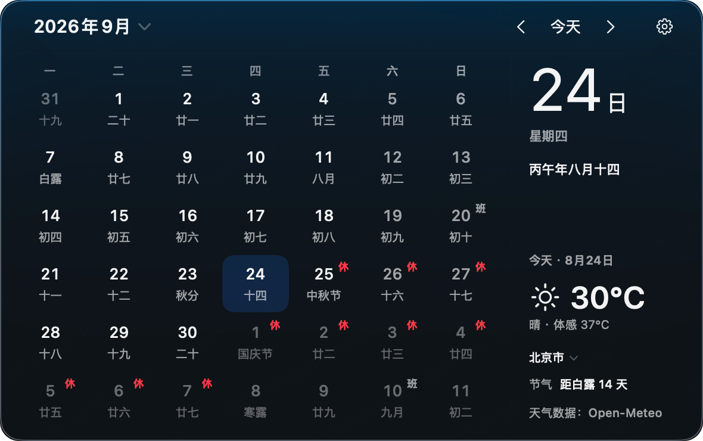

# Calenda

Calenda 是一款原生 macOS 菜单栏日历。点击菜单栏上的日期，即可打开一块固定尺寸的日历面板，快速查看公历日期、农历与二十四节气、中国法定节假日调休安排，以及当前天气。它无需账号、没有后端服务，也不包含任何遥测或分析；公历、农历和节气完全离线可用。

Calenda 是菜单栏应用（LSUIElement）：启动后不出现在 Dock，只驻留在菜单栏右侧。

## 功能一览

**日历**

- 42 格公历月历，每周首日可选周一、周日或跟随系统。
- 农历日期、农历节日与二十四节气，可在设置中分别开关。
- 中国法定节假日与调休上班标记；安装包内置 2025、2026 年数据快照，联网后自动检查更新。
- 月份选择器、上/下月切换、回到今天。

**天气（可选）**

- 在详情栏底部显示“今天”的当前天气：温度、体感温度、天气现象和观测时间，不随选中日期变化。
- 摄氏 / 华氏切换；默认城市为北京，支持中文搜索手动选城，也可按需使用一次当前位置。
- 天气功能可整体关闭；关闭或断网时日历照常使用。

**系统集成**

- 可选的登录时自动启动。
- 原生设置窗口，含缓存与位置清理。
- 完整的键盘导航与 Escape 关闭面板。

## 界面与操作

面板内容尺寸固定为 590 × 370 pt，右侧详情栏宽 160 pt（面板尺寸与列宽以 [PanelConfiguration.swift](Calenda/AppKitShell/PanelConfiguration.swift) 为唯一来源）。左侧是月历；右侧详情栏顶部是选中的日期，中部是选中日期的农历 / 节气 / 节假日信息槽位，底部固定为“今天”的天气与节气摘要——切换日期或天气请求完成都不会推动底部内容。

| 操作 | 效果 |
| --- | --- |
| 点击日期格 | 选中该日期 |
| ← / → | 前 / 后移动一天 |
| ↑ / ↓ | 前 / 后移动一周 |
| ⌘ ← / → | 前 / 后移动一个月 |
| ⌥ ← / → | 前 / 后移动一年 |
| ⌘T | 回到今天 |
| Esc 或点击面板外 | 关闭面板 |
| 右键点击菜单栏图标 | 打开“设置 / 退出”菜单 |

## 界面预览


## 设置

设置窗口为单实例原生窗口，包含五个分区：

- **通用**：每周首日、显示农历、显示节气、菜单栏样式（仅图标 / 图标 + 日期）。
- **天气**：天气开关、温度单位、位置（手动搜索城市、使用当前位置或恢复默认北京）、手动刷新。
- **节假日**：节假日显示开关、手动检查更新（60 秒节流），并以“年份：状态 · 来源 · 更新时间”摘要展示各年份数据状况。
- **隐私与存储**：一键清除天气 / 节假日磁盘缓存并重置位置（需二次确认）。
- **登录**：登录时启动开关，需要系统批准时可跳转到系统设置。

## 数据来源与版权

Calenda 自身代码以 [MIT License](LICENSE) 发布，同时依赖以下第三方代码与数据，在此明确致谢（完整声明见 [THIRD_PARTY_NOTICES.md](THIRD_PARTY_NOTICES.md)）：

| 能力 | 来源 | 许可 / 条款 |
| --- | --- | --- |
| 农历、农历节日、二十四节气 | [Tyme4Swift](https://github.com/6tail/tyme4swift) v1.5.0（作者 6tail） | MIT |
| 中国法定节假日与调休 | [NateScarlet/holiday-cn](https://github.com/NateScarlet/holiday-cn)（上游自动抓取国务院办公厅放假公告，每年数据文件的 `papers` 字段附公告原文链接） | MIT |
| 当前天气与城市搜索 | [Open-Meteo](https://open-meteo.com/) Forecast API 与 Geocoding API | [使用条款](https://open-meteo.com/en/terms)：免费档仅限非商业用途，数据以 CC BY 4.0 提供并要求署名 |

节假日数据在运行时按固定镜像链（jsDelivr CDN → jsDelivr Fastly → GitHub Raw）刷新，支持 ETag / Last-Modified 协商缓存与最后有效数据回退；内置快照与镜像内容均来自上述仓库。

> **商用提示**：Open-Meteo 免费档明确仅限非商业用途。若你分发包含天气功能的商业版本，需自行购买 Open-Meteo 商业订阅或更换天气提供商；农历与节假日组件（MIT）允许商用，但须保留版权声明。

## 隐私与网络行为

- 应用启用 App Sandbox，仅申请网络客户端与按需定位两项能力；定位用途描述为“仅用于查询本地天气”。
- 公历、农历、节气完全离线；节假日先读内置快照与本地缓存，天气先读缓存，网络失败不会阻止日历渲染。
- 出站请求仅面向 5 个固定 HTTPS 主机（`NetworkPolicy.trustedHosts` 白名单），重定向逐跳校验，使用不落盘的 ephemeral 会话，不携带 Cookie。
- 位置权限不会在启动时请求；只有选择“使用当前位置”时触发一次性定位，失败时回退默认城市。
- 偏好保存在 UserDefaults；天气缓存位于 `~/Library/Application Support/Calenda/Weather/`，节假日缓存位于 `~/Library/Application Support/Calenda/Holidays/`，均可在设置中清除。
- 无账号、无遥测、无分析、无后端服务。

## 技术架构

- macOS 26+，Swift 6 语言模式，完整 Strict Concurrency 检查。
- AppKit 负责菜单栏与窗口生命周期：NSStatusItem → StatusItemController → NSPanel → NSHostingView → SwiftUI 内容；SwiftUI 负责月历、详情栏与设置界面。
- `AppModel` 是 MainActor 上的可观察状态所有者；`LunarService`、`HolidayService`、`WeatherService`、`LocationService` 使用 actor 隔离，外部能力一律通过服务边界访问。
- Tyme4Swift 仅在 `TymeLunarAdapter` 内部使用，不向 SwiftUI 层泄漏第三方类型。

```
Calenda/
├── App/                    # 入口、AppModel、ShellActions
├── AppKitShell/            # NSStatusItem、NSPanel、设置窗口、事件监视
├── Domain/                 # 领域模型：日历、农历、节假日、天气、位置、设置
├── Features/               # SwiftUI 视图：月历、面板、天气、设置
├── Infrastructure/         # 网络策略、客户端与缓存、Tyme 适配
├── Services/               # 领域服务：日历、农历、节假日、天气、定位、登录项
└── Resources/              # 内置节假日快照、本地化字符串
CalendaTests/               # 单元测试
CalendaUITests/             # UI 测试
scripts/input-source-switcher/  # UI 测试前切换系统输入法的辅助工具
```

## 构建与测试

需要 Xcode 27 beta 5 或更新版本（macOS 26 SDK）。共享 scheme 为 `Calenda`：

```bash
# 构建
xcodebuild -project Calenda.xcodeproj -scheme Calenda \
  -configuration Debug -destination 'platform=macOS' build

# 单元测试（串行执行，当前异步测试套件下结果更稳定）
xcodebuild -project Calenda.xcodeproj -scheme Calenda \
  -configuration Debug -destination 'platform=macOS' \
  -parallel-testing-enabled NO test -only-testing:CalendaTests

# 单条 UI 测试
xcodebuild -project Calenda.xcodeproj -scheme Calenda \
  -configuration Debug -destination 'platform=macOS' \
  -parallel-testing-enabled NO test \
  -only-testing:CalendaUITests/CalendaUITests/testCombinedHolidayNamesOnlyAnchorsInDayCells
```

说明：

- Calenda 是 LSUIElement 应用，启动后没有 Dock 图标和主窗口，需要点击菜单栏图标验证运行时行为；面板生命周期、定位、多显示器相关的改动需在真实环境验证。
- 设置 `CALENDA_DISABLE_NETWORK_REFRESH=1` 可在测试环境中禁用节假日与天气的网络刷新。
- UI 测试会先结束已有的 `Calenda` 进程以避免残留状态项，请勿与手动启动的实例同时运行。

单元测试覆盖月历计算、农历适配、节假日镜像链与缓存回退、天气缓存与网络错误映射、位置、设置、菜单栏图标和面板状态机；UI 测试覆盖状态项、键盘关闭、月份选择器、设置窗口与详情栏布局锚点。

## 许可证

代码以 [MIT License](LICENSE) 发布，第三方声明见 [THIRD_PARTY_NOTICES.md](THIRD_PARTY_NOTICES.md)。分发或二次开发时请保留版权与许可声明，并遵守“数据来源与版权”一节所列第三方条款（尤其是 Open-Meteo 的署名要求与非商业限制）。

## 当前边界

仓库尚不包含：CI 配置、发布签名 / 公证流程、Release 产物。节假日内置快照目前覆盖 2025–2026 年，更多年份依赖联网更新。
